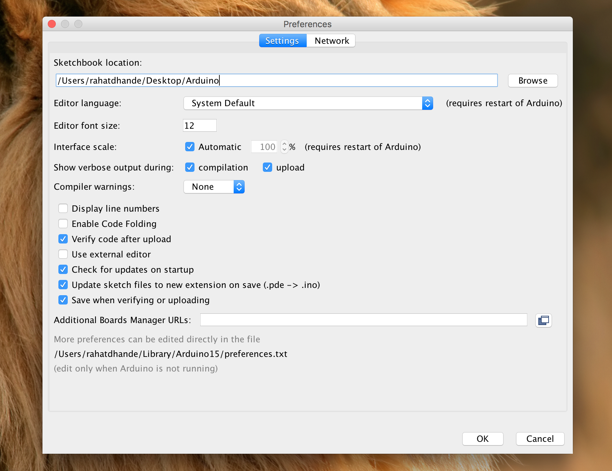

# das_pan
As part of Engineering Physics 253, a course at the University of British Columbia, we entered the [**2016 Engineering Physics Uber-Bots Robot Competition**](http://projectlab.engphys.ubc.ca/enph-253-2016/competition-2016/).
We came up with an innovative solution to allow a self-driving car to pick up and drop off passengers all over a miniature city.
### For details on our solution, please visit our [website](https://andrewdworschak.github.io/das_pan).

### Code usage instructions
> Upload `robot.ino` to the TINAH.
> If you clone this repo and wish to compile using `arduino`'s IDE, you’ll need to change the `sketchbook location` to the path to the repo directory on your machine.

> To test the sensors and calibrate the actuators, run `test.ino`.
> To test the path finding algorithm, run `nav.ino`.

### To view the website locally:
> Install python on your machine and clone the repository.
> Enter `$ python -m SimpleHTTPServer 8000` in the terminal.
> Visit `localhost:8000` in your browser.
